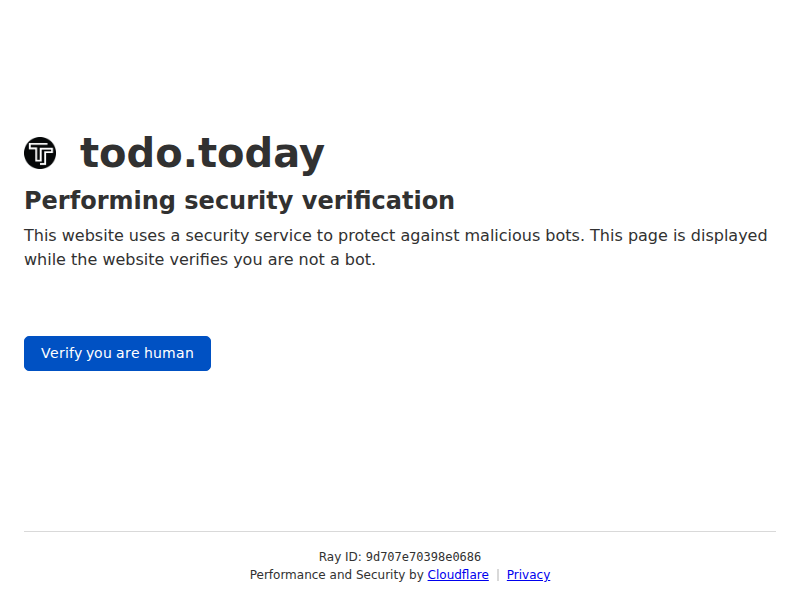
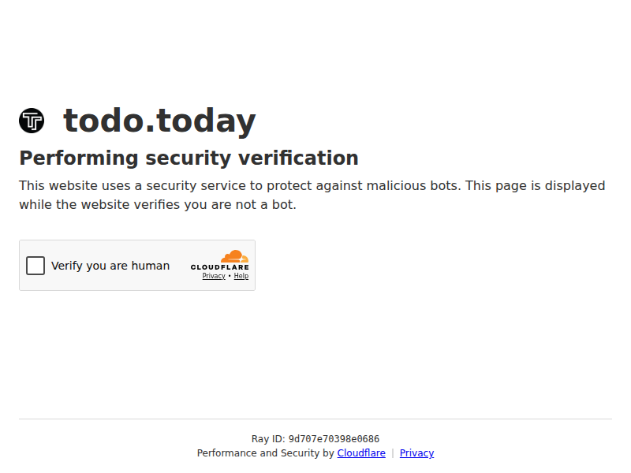

# Fix todo.today scraper - Cloudflare CAPTCHA Detection

## Problem

todo.today has implemented Cloudflare CAPTCHA protection that blocks automated scraping. The site now returns a "Verify you are human" challenge page instead of the event listing.

### What Changed
- The site is now protected by Cloudflare's managed challenge (CAPTCHA)
- Both browser navigation and REST API calls are blocked
- Returns 403 with "Just a moment..." or "Verify you are human" page

### Screenshots

**Cloudflare Challenge Page (Step 1):**


**Cloudflare CAPTCHA Widget (Step 2):**


## Fix

Updated the scraper to explicitly detect and report Cloudflare blocking:

1. **In `launchFreshBrowser()`**: Added detection for Cloudflare challenge pages after navigation
2. **In `fetchListingEventsFromPage()`**: Added detection for Cloudflare responses from REST API calls

### Error Messages

The scraper now throws descriptive errors:
```
CLOUDFLARE_BLOCKED: todo.today is now protected by Cloudflare CAPTCHA. 
The page loaded a Cloudflare challenge instead of the event listing.
```

### Why This Fix Is Correct

- ✅ The scraper FAILS loudly when blocked (as required - never silently skip events)
- ✅ Clear error message indicates the exact issue (Cloudflare protection)
- ✅ No try/catch blocks that hide errors
- ✅ The failure alerts maintainers that a different approach is needed

### Future Considerations

To scrape this site again, you would need:
- Residential proxy service (e.g., Bright Data, ScrapingBee)
- CAPTCHA solving service (e.g., 2Captcha)
- Or manual data entry

## Verification

Tested locally:
```bash
TODOTODAY_LOCATIONS=ubud bun run scripts/scrape-todotoday.ts
```

Results: Scraper correctly detects Cloudflare and throws `CLOUDFLARE_BLOCKED` error.
